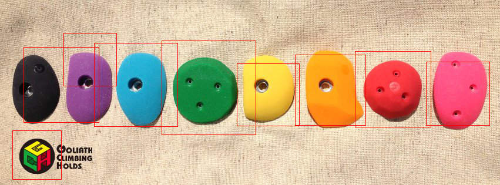

!SLIDE subsection
# OpenCVいじってみた #

!SLIDE bullets incremental
# もくじ #

* OpenCVって何さ？
* オブジェクト検出
  + 機械学習
  + オブジェクト検出器
* 何に使おうか？
  + 笑い男ごっこ（俺の目を盗んだな）
  + I am ぼるだりんがー
  + うちの子(ランバ・ラル)検出

!SLIDE smaller
# OpenCVって何さ？

* 線形代数や統計処理など，コンピュータビジョンに必要な各種数学関数
* 直線や曲線，テキストなど画像への描画関数
* OpenCVで使用したデータを読み込み/保存するための関数
* エッジ等の特徴抽出や画像の幾何変換，カラー処理等々の画像処理関数
* 物体追跡や動き推定などの動画像処理用関数
* 物体検出などのパターン認識関数
* 三次元復元のためのカメラ位置や姿勢の検出などのカメラキャリブレーション関数
* コンピュータにパターンを学習させるための機械学習関数
* 画像の読み込みや保存，表示，ビデオ入出力などインターフェース用関数

!SLIDE small

                         ／）
                      ／／／）
                   ／,.=ﾞ''"／
      ／         i f  ,.r='"-‐'つ＿＿＿_      こまけぇこたぁいいんだよ！！
    /           /      _,.-‐'~／⌒    ⌒＼
        ／     ,i      ,二ﾆ⊃（ ●）.  （●）＼
      /       ﾉ       ilﾞフ::::::⌒（__人__）⌒::::: ＼
            ,ｲ｢ﾄ､    ,!,!|          |r┬-|          |
          /  iﾄヾヽ_/ｨ"＼         `ー'´       ／

## 結局何がしたいって画像認識だしね

!SLIDE subsection
# オブジェクト検出 #

!SLIDE
## オブジェクト検出の流れ
* サンプル作成
* 機械学習によって検出器作成
  
* 検出器を使って目的のオブジェクトを検出

!SLIDE small
# サンプル作成と機械学習

  

!SLIDE small
# サンプル作成と機械学習

* OK.txt作らなきゃ
* [ObjectMarker](https://github.com/takmin/ObjectMarker)なるものがあるらしい
* ビルドできない(情弱)
* 作りゃいいじゃん(ｼﾞｬｯｳﾞｧで)  
  →GAIAで培ったMVCをガン無視する技術でGUIを作成  
  (現在MVCに則って改造中)

!SLIDE commandline incremental small 

## 作成したOK.txtでサンプル作成からの機械学習

    $ createsamples -info OK.txt -vec pos_output.vec -num 4000 -bgcolor 255 -w 44 -h 18
    $ haartraining -data hoge -vec output.vec -bg NG.txt -npos 4000 -nneg 1685 -w 44 -h 18 -mode ALL

                         ／）
                      ／／／）
                   ／,.=ﾞ''"／
      ／         i f  ,.r='"-‐'つ＿＿＿_      コマンド打ちゃあいいんだよ！！
    /           /      _,.-‐'~／⌒    ⌒＼
        ／     ,i      ,二ﾆ⊃（ ●）.  （●）＼
      /       ﾉ       ilﾞフ::::::⌒（__人__）⌒::::: ＼
            ,ｲ｢ﾄ､    ,!,!|          |r┬-|          |
          /  iﾄヾヽ_/ｨ"＼         `ー'´       ／

＿人人人人人人人人人人人人人人人人人＿  
＞　めっちゃ時間かかるけどな！！！　＜  
￣Y^Y^Y^Y^Y^Y^Y^Y^Y^Y^Y^Y^Y^Y^Y^Y￣  

!SLIDE commandline incremental
## オブジェクト検出器

さっきめっちゃ時間かけて作ったXMLのことです(嫌な思い出)  
使います(Rubyで)  

まずは

    $ bundle init
    $ echo 'gem "ruby-opencv"' >> Gemfile
    $ bundle install --path vendor/bundle

    @@@ruby
    detector = CvHaarClassifierCascade::load("hoge.xml")

!SLIDE subsection
# 何に使おうか？
## ~笑い男ごっこ編~

!SLIDE
さっきめっちゃ時間かけて作った検出器ではないものを使って顔検出  
(だって顔検出器OpenCVに入ってんだもん)  
→笑い男になれる！

!SLIDE execute smaller
# これであなたも笑い男

    @@@ruby
    require 'opencv'
    include OpenCV

    def laughing_man(image, rect, laughing_man)
      image.set_roi rect
      laughing_man_resized = laughing_man.resize rect
      (image.rows * image.cols).times do |i|
        image[i] = laughing_man_resized[i] unless laughing_man_resized[i][0] == 0.0
      end
      image.reset_roi
    end

!SLIDE execute smaller
# これであなたも笑い男続き

    @@@ruby
    camera = CvCapture.open(0)
    face = CvHaarClassifierCascade::load("#{HAAR_CASCADE_PATH}/haarcascade_frontalface_default.xml")

    window = GUI::Window.new('camera')
    laughing_man_img = CvMat.load('LAUGHINGMAN_PATH/laughingman.png')

    while GUI::wait_key(50).nil?
      image = camera.query
      puts image.class
      image = image.resize(CvSize.new(500, 350))

      face.detect_objects(image) do |face_rect|
        laughing_man(image, face_rect, laughing_man_img)
      end

      window.show image
    end

    window.destroy

!SLIDE subsection
# 何に使おうか？
## ~ボルダリング編~

!SLIDE smaller
## ちゃんと作った検出器使わねば

    @@@ruby
    require 'opencv'
    include OpenCV

    boulder = CvHaarClassifierCascade::load("./mark_test/bouldering_hold.xml")

    window = GUI::Window.new('boulder')
    image = IplImage.load(ARGV[0])

    boulder.detect_objects(image) do |hold|
      topleft = CvPoint.new(hold.x, hold.y)
      bottomright = CvPoint.new(hold.x + hold.width, hold.y + hold.height)
      image.rectangle!(topleft, bottomright, color: CvColor::Red, thickness: 1)
    end

    window.show image

    GUI::wait_key
    GUI::Window.destoy_all

!SLIDE
## 結果

微妙(白目)

!SLIDE
# (白目)

|ポジティブ画像  |ネガティブ画像  |学習時間  |精度(抽象的なもの)|
|:---------------|:---------------|:---------|:-------------------|
|3,000枚         |20枚            |約40分    |ほとんど正しく検出されません|
|4,000枚         |2,000枚         |約8時間   |誤検出が見られます|
|8,000枚         |4,000枚         |約1週間   |誤検出がほとんどありません|

!SLIDE
地道に枚数増やしていきます  
そうします

!SLIDE subsection
# 何に使おうか？
## ~緑のランバ・ラル編~

!SLIDE small

我が家にぐーふーがきたんですよ  

!SLIDE

名前は<strike>ランバラル</strike>  
まるたろう  

でも僕はランバラルって(心の中で)呼び続けようと思うんだ

!SLIDE
## <strike>ランバラル</strike>まるたろうを見ていて気付いたのは以外と個体によって顔も模様も違うってこと  

まるたろう(ランバラル)の写真撮りまくって、  
他の個体の写真をNGにしたら、  
(おそらく)世界初ミドリフグの個体識別ができるんじゃないか？

!SLIDE
## COMING SOON

!SLIDE subsection

# ご清聴ありがとうございます
