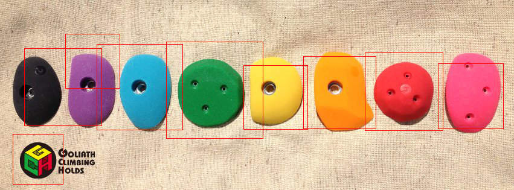

!SLIDE subsection
# 何に使おうか？
## ~ボルダリング編~

!SLIDE smaller
## ちゃんと作った検出器使わねば

    @@@ruby
    require 'opencv'
    include OpenCV

    hold_detector = CvHaarClassifierCascade::load("./mark_test/bouldering_hold.xml")

    window = GUI::Window.new('boulder')
    image = IplImage.load(ARGV[0])

    hold_detector.detect_objects(image) do |hold|
      topleft = CvPoint.new(hold.x, hold.y)
      bottomright = CvPoint.new(hold.x + hold.width, hold.y + hold.height)
      image.rectangle!(topleft, bottomright, color: CvColor::Red, thickness: 1)
    end

    window.show image

    GUI::wait_key

!SLIDE
## 結果

微妙(白目)

!SLIDE
# (白目)

|ポジティブ画像  |ネガティブ画像  |学習時間  |精度(抽象的なもの)|
|:---------------|:---------------|:---------|:-------------------|
|3,000枚         |20枚            |約40分    |ほとんど正しく検出されません|
|4,000枚         |2,000枚         |約8時間   |誤検出が見られます|
|8,000枚         |4,000枚         |約1週間   |誤検出がほとんどありません|

!SLIDE
地道に枚数増やしていきます  
そうします

!SLIDE
# 実演はなしで
## No Demonstration

